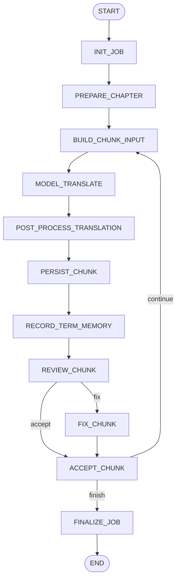
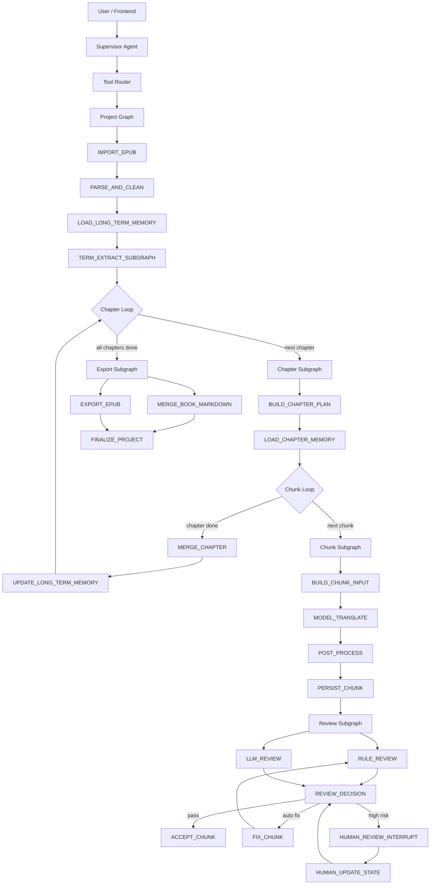

# NovelFlow 项目交接说明

本文档用于把当前项目交给另一个 Codex 继续开发。项目根目录：

`D:\Java代码Oncall\SuperBizAgent-release-2026-01-02`

当前目标不是继续做原来的 Oncall/RAG 项目，而是把它改造成一个面向日语轻小说 EPUB 翻译的 Agent Runtime。核心方向是：EPUB 解析、章节拆分、SakuraLLM 分段翻译、术语记忆、审校修订、Spring AI Alibaba Graph 编排、Redis checkpoint、后续 human-in-the-loop 和 time travel。

## 1. 项目定位

项目名可以暂定为 `NovelFlow`。

它的简历定位应该是：

> 基于 Spring AI Alibaba Graph 构建日语轻小说翻译 Agent Runtime，将 EPUB 解析、章节拆分、术语记忆、分段翻译、译文审校、自动修订、状态持久化和产物导出建模为显式任务图；Supervisor Agent 和审校/修订模型使用阿里云百炼 DashScope `qwen3.7-plus`，正文翻译模型使用本地 SakuraLLM/Ollama，并通过 Redis checkpoint、文件产物落盘和运行时状态投影实现进度追踪、审校追溯和后续断点恢复扩展。

这个项目目前更像“Agent Runtime + Tool Orchestration”，而不是普通的“调用大模型翻译小说”。

## 2. 当前运行方式

### 2.1 前置依赖

本地需要启动：

- Spring Boot：端口 `8082`
- Ollama：端口 `11434`
- Redis：端口 `6379`，用户本地容器名是 `redis_novel`

当前配置默认走 Redis checkpoint：

```yaml
novel:
  graph:
    checkpoint:
      saver: redis
      redis:
        address: redis://localhost:6379
        database: 0
```

如果 Redis 没启动，可以临时把 `novel.graph.checkpoint.saver` 改成 `file`。

### 2.2 模型配置

正文翻译模型仍走本地 Ollama：

```text
hf.co/SakuraLLM/Sakura-7B-Qwen2.5-v1.0-GGUF:latest
```

Supervisor Agent / 审校 / 修订模型走 DashScope：

```text
qwen3.7-plus
```

配置位置：

`src/main/resources/application.yml`

关键配置：

```yaml
novel:
  translation:
    base-url: http://localhost:11434
    model: hf.co/SakuraLLM/Sakura-7B-Qwen2.5-v1.0-GGUF:latest
    temperature: 0.1
    top-p: 0.3
    num-ctx: 8192
    num-gpu: 999
    num-predict: 1536
    chunk-size: 1200
    glossary-path: ./config/novel-glossary.json
    context-source-chars: 800
    context-translation-chars: 800
    review-enabled: true
    fix-enabled: true
```

Spring AI 的通用聊天模型配置：

```yaml
spring:
  ai:
    model:
      chat: dashscope
    dashscope:
      api-key: ${AI_DASHSCOPE_API_KEY:...}
      chat:
        options:
          model: qwen3.7-plus
```

### 2.3 启动命令

在项目根目录运行：

```powershell
mvn -DskipTests spring-boot:run
```

或者在 IDEA 里直接运行 `org.example.Main`。

启动后打开：

```text
http://localhost:8082
```

页面里选择 `NovelFlow 上传小说`，上传 EPUB 后，会自动创建项目、上传原文、拆分章节。

## 3. 当前已完成的能力

### 3.1 EPUB 上传和章节拆分

相关代码：

- `src/main/java/org/example/novel/controller/NovelWorkflowController.java`
- `src/main/java/org/example/novel/service/NovelProjectService.java`
- `src/main/java/org/example/novel/service/ChapterSplitService.java`
- `src/main/java/org/example/novel/service/EpubTextExtractor.java`

当前支持：

- 上传 `.txt`、`.md`、`.epub`
- 为每本小说创建独立项目目录
- EPUB 解析 `container.xml`、OPF、spine、NCX toc
- 优先按 EPUB 目录拆章节
- 过滤封面、目录、版权页、奥付等非正文项
- 对正文 HTML 做基础清洗
- 删除 ruby 注音标签中的 `rt/rp/rtc`，避免 `呆ぼう然ぜん` 这种假名揉进正文
- 章节输出为 Markdown 文件

已验证过 `かがみの孤城` 这本 EPUB 能拆成 13 个正文章节，例如：

```text
001_五月.md
002_六月.md
003_七月.md
...
013_エピローグ.md
```

注意：`ChapterSplitService` 仍会写 `config/progress.yaml`，这是早期遗留的人可读进度文件。后续不要把它作为 Runtime 主状态继续扩展。

### 3.2 项目目录结构

每次上传小说会生成：

```text
novel-projects/<projectId>/
  raw/                         原始上传文件
  source/                      拆分后的章节 Markdown
  output/                      当前译文输出
    001_五月.md
    chunks/
      001_五月/
        part-001.md
        part-002.md
        progress.json
  polished/                    最终章节译文副本
  review/
    chunks/
      001_五月/
        part-001.review.json
        part-001.fix.json
  config/
    chapter_manifest.json
    progress.yaml              早期遗留，不应作为主状态
    runtime-state.json         前端/人看的状态投影
    term-memory.json           项目术语记忆
    jobs/
      translation-xxxx.json    后台翻译任务状态
  logs/
    events.jsonl               业务事件流
```

### 3.3 SakuraLLM 分段翻译

相关代码：

- `src/main/java/org/example/novel/service/OllamaNovelTranslationClient.java`
- `src/main/java/org/example/novel/service/NovelTranslationService.java`
- `src/main/java/org/example/novel/service/NovelTranslationTextPostProcessor.java`

当前翻译流程：

1. 读取章节 Markdown。
2. 按 `novel.translation.chunk-size` 分段，当前是 `1200` 字符。
3. 每段调用 Ollama `/api/chat`。
4. 使用 SakuraLLM 推荐风格的 prompt：
   - 无术语表时：`将下面的日文文本翻译成中文：...`
   - 有术语表时：`根据以下术语表（可以为空）：src->dst #info ... 将下面的日文文本根据对应关系和备注翻译成中文：...`
5. 从上一段注入 source/translation 尾部上下文：
   - `context-source-chars: 800`
   - `context-translation-chars: 800`
6. 每翻译完一个 chunk：
   - 写入 `output/chunks/<chapter>/part-xxx.md`
   - 追加/重建章节累计译文 `output/<chapter>.md`
   - 更新 `output/chunks/<chapter>/progress.json`
   - 记录术语命中到 `config/term-memory.json`

### 3.4 文件术语表和术语记忆

全局术语表文件：

`config/novel-glossary.json`

当前格式：

```json
[
  {
    "src": "こころ",
    "dst": "心",
    "info": "主角名，不能译为亚纪"
  }
]
```

这个格式和 SakuraLLM README 的 `src->dst #info` 提示方式对齐。

相关代码：

- `NovelTranslationTextPostProcessor`
- `NovelTermMemoryService`

当前机制：

- 启动/翻译时读取 `config/novel-glossary.json`
- 自动注入 Sakura 翻译 prompt
- 每个项目会生成 `config/term-memory.json`
- `term-memory.json` 会合并静态术语和当前项目命中过的术语
- 审校和修订会优先遵守锁定术语
- 角色名冲突检查只对 `info` 中包含 `角色名` 或 `主角名` 的术语生效，避免把学校名、机构名、称呼误判成角色名

当前全局术语表示例：

```text
かがみの孤城 -> 镜之孤城 #作品标题
こころ -> 心 #主角名，不能译为亚纪
アキ -> 亚纪 #角色名，与こころ不是同一人
スバル -> 昴 #角色名
マサムネ -> 征宗 #角色名
マサヤ -> 正也 #角色名，不能译为征宗
フウカ -> 风香 #角色名
ウレシノ -> 乌里诺 #角色名
リオン -> 里昂 #角色名
オオカミさま -> 大野狼大人 #称呼
心の教室 -> 心灵教室 #机构名，free school 名称，不是主角名
雪科第五中学 -> 雪科第五中学 #学校名
```

### 3.5 审校和自动修订闭环

相关代码：

- `src/main/java/org/example/novel/service/NovelTranslationReviewService.java`
- `src/main/java/org/example/novel/service/NovelTermMemoryService.java`
- `src/main/java/org/example/novel/service/NovelTranslationService.java`

当前审校流程：

```text
TRANSLATE_CHUNK
-> REVIEW_CHUNK
-> FIX_CHUNK（仅在可自动修的问题上触发）
-> ACCEPT_CHUNK
```

审校包含两类：

1. 确定性规则审校：
   - 是否残留日文假名
   - prompt 标签是否泄漏
   - 引号是否明显不平衡
   - 是否出现已知错误译名变体
   - 译文是否明显过短/过长
   - 锁定术语是否缺失或冲突

2. Qwen LLM 审校：
   - 使用 `spring.ai.dashscope.chat.options.model`
   - 当前是 `qwen3.7-plus`
   - 要求输出 JSON
   - 结果会被过滤，不能推翻锁定术语

重要注意：

- `review.json` 里的 `rawAnalysis` 是 qwen 原始输出，可能会胡说，不能作为最终可信结论。
- 真正要看的字段是 `status`、`summary`、`issues`、`needsFix`、`llmStatus`。
- 当前自动修订只允许确定性问题触发，比如术语缺失、残留日文、prompt 泄漏、长度异常等。
- 如果 LLM 只是主观认为“不通顺”或猜人物关系，默认不自动改，应该进入后续人工审校。

### 3.6 后台翻译任务

相关代码：

- `NovelWorkflowController`
- `NovelTranslationJobService`

旧同步接口：

```text
POST /api/novels/projects/{projectId}/translate
```

已经禁用。

当前使用后台任务：

```text
POST /api/novels/projects/{projectId}/translation-jobs
```

请求体：

```json
{
  "chapterIndex": 1
}
```

后台任务文件：

```text
novel-projects/<projectId>/config/jobs/<jobId>.json
```

支持：

- 创建 job
- 查询 job
- 取消 job
- 重试 job
- 防止同一项目同一章节重复跑多个任务

### 3.7 Spring AI Alibaba Graph Core 接入

相关代码：

`src/main/java/org/example/novel/service/NovelTranslationJobService.java`

当前已经接入：

- `StateGraph`
- `CompiledGraph`
- `CompileConfig`
- `SaverConfig`
- `RedisSaver`
- `FileSystemSaver`
- `RunnableConfig.threadId(jobId)`
- `getStateHistory`
- `stateOf`
- `GraphLifecycleListener`
- Mermaid graph 输出

当前 Graph 节点：



当前 Graph state 里会放：

```text
jobId
projectId
chapterIndex
currentNode
chapterPlan
currentChunkIndex
completedChunks
totalChunks
translatedText
previousSourceText
previousTranslatedText
chunkInput
chunkSourceText
chunkGlossaryPrompt
rawTranslatedText
postProcessedTranslatedText
latestChunkIndex
latestSourceText
latestTranslatedText
reviewIssueCount
latestReviewStatus
latestReviewSummary
latestReviewPath
latestReviewNeedsFix
latestFixStatus
latestFixSummary
latestFixPath
reviewUnresolvedCount
acceptedChunks
termMemoryPath
outputPath
translatedCharCount
```

### 3.8 Redis checkpoint

当前 Redis 用法：

- `novel.graph.checkpoint.saver=redis`
- `NovelTranslationJobService` 创建 Redisson client
- `RedisSaver.builder().redisson(client).build()`
- 编译 Graph 时注册 saver
- 每个任务的 `threadId` 是 `jobId`

Redis key 不是项目名，而是 Spring AI Alibaba Graph RedisSaver 自己管理的 checkpoint key。项目和任务对应关系看：

```text
projectId -> config/jobs/<jobId>.json -> jobId -> Redis threadId
```

也就是：

- 项目名：`novel-...`
- 任务名：`translation-...`
- Graph checkpoint threadId：`translation-...`

这是正常的。要查某个项目的 Redis checkpoint，先看该项目 `config/jobs/*.json` 里的 `jobId`。

当前已经暴露 Graph 查询接口：

```text
GET /api/novels/projects/{projectId}/translation-jobs/{jobId}/graph-state
GET /api/novels/projects/{projectId}/translation-jobs/{jobId}/graph-history
GET /api/novels/translation-graph
```

注意：

- Redis 里看到乱码是正常的，Graph checkpoint 是框架序列化状态，不是给人手工读的。
- 应通过 `graph-state` 和 `graph-history` 接口看，不要直接在 Redis GUI 里解读。

### 3.9 IDEA 日志

当前 `NovelTranslationJobService` 注册了 `GraphLifecycleListener`，会输出节点运行日志：

```text
NovelFlow Graph BEFORE/AFTER/COMPLETE
node=...
jobId=...
projectId=...
chapter=...
currentChunk=...
completed=...
reviewStatus=...
fixStatus=...
checkpoint=...
```

`NovelTranslationService` 会输出：

```text
开始翻译章节
调用 Ollama 翻译分段
分段翻译完成
章节翻译完成
```

`NovelTranslationReviewService` 会输出：

```text
分段审校完成
分段修订完成
```

## 4. 当前可用 API

基础流程：

```text
POST /api/novels/projects
POST /api/novels/projects/{projectId}/source
POST /api/novels/projects/{projectId}/split
GET  /api/novels/projects/{projectId}
```

运行状态：

```text
GET /api/novels/projects/{projectId}/runtime-state
GET /api/novels/projects/{projectId}/term-memory
```

后台翻译任务：

```text
POST /api/novels/projects/{projectId}/translation-jobs
GET  /api/novels/projects/{projectId}/translation-jobs/{jobId}
POST /api/novels/projects/{projectId}/translation-jobs/{jobId}/cancel
POST /api/novels/projects/{projectId}/translation-jobs/{jobId}/retry
```

Graph：

```text
GET /api/novels/translation-graph
GET /api/novels/projects/{projectId}/translation-jobs/{jobId}/graph-state
GET /api/novels/projects/{projectId}/translation-jobs/{jobId}/graph-history
```

译文读取：

```text
GET /api/novels/projects/{projectId}/translations/{chapterIndex}?offset=0&limit=2500
GET /api/novels/projects/{projectId}/translations/{chapterIndex}/progress
```

### 4.1 NovelFlow Supervisor Agent

当前 `/api/chat` 和 `/api/chat_stream` 已改成 `NovelFlow Supervisor Agent`，不再挂旧 RAG/Oncall 工具。

相关代码：

- `src/main/java/org/example/service/ChatService.java`
- `src/main/java/org/example/novel/agent/tool/NovelWorkflowTools.java`
- `src/main/java/org/example/novel/service/NovelExportService.java`

Agent 职责：

- 理解用户自然语言意图
- 调用 NovelFlow 工具
- 不直接翻译整章正文
- 长任务交给 Graph Runtime
- 工具输出全部返回 JSON
- 工具调用会输出 `NovelFlow Agent Tool START/END/ERROR` 日志

当前工具：

```text
listNovelProjects
createNovelProject
splitNovelProject
startChapterTranslation
getTranslationJob
cancelTranslationJob
retryTranslationJob
getNovelProjectStatus
getNovelRuntimeState
getNovelTermMemory
updateNovelTerm
getTranslationGraphState
getTranslationGraphHistory
readChapterTranslation
getTranslationProgress
exportNovel
```

## 5. 当前前端状态

前端文件：

```text
src/main/resources/static/index.html
src/main/resources/static/app.js
src/main/resources/static/styles.css
```

当前支持：

- 上传 EPUB/TXT/MD
- 自动创建项目、上传、拆章节
- 输入“翻译第一章”“翻译第二章”等自然语言触发后台翻译任务
- 轮询 job 和 progress
- 控制台输出最新 chunk preview
- 翻译完成后读取章节前 2500 字展示
- 输入“继续”可以继续读取当前章节后续译文

前端还很基础，不是完整工作台。

## 6. 当前存在的问题和限制

### 6.1 Graph Core 还没有完全原生化

虽然已经接入 Graph Core、Redis checkpoint、state/history，但当前架构仍有明显过渡状态：

- `TRANSLATE_NEXT_CHUNK` 已拆成 `BUILD_CHUNK_INPUT`、`MODEL_TRANSLATE`、`POST_PROCESS_TRANSLATION`、`PERSIST_CHUNK`、`RECORD_TERM_MEMORY`。
- 但副作用节点的幂等策略还只是基础版本，`PERSIST_CHUNK` 仍需要补 hash/版本校验。
- `MODEL_TRANSLATE` 结果已经进入 Graph state，但还没有做成可复用的模型响应 artifact cache。
- checkpoint 恢复目前还没有做成用户可操作的 resume。
- `runtime-state.json` 是人工维护的状态投影，不是 Graph State 的唯一事实来源。

### 6.2 还没有真正 human-in-the-loop

当前状态里有 `NEED_REVIEW`，但它只是业务状态，不是 Graph Core 的真正 interrupt。

还缺：

- `InterruptableAction`
- `interruptBefore`
- `updateState`
- 用户修改译文后继续 `graph.stream(null, resumeConfig)`
- 前端人工审校界面

### 6.3 还没有 time travel

当前可以查 `graph-history`，但还没做：

- 选择某个 `checkpointId`
- 回到某个 chunk 之前
- 修改术语表或 prompt
- 从该 checkpoint 分支重译
- A/B 对比译文

### 6.4 还没有 Graph streaming / SSE

前端现在主要靠轮询：

- job 状态
- progress.json
- translations read

后续应该改为：

- 后端使用 `graph.stream()`
- 节点输出通过 SSE/WebFlux 推到前端
- 前端实时显示节点开始、chunk 完成、审校问题、修订结果、checkpointId

### 6.5 没有子图

当前所有 Graph 节点都堆在 `NovelTranslationJobService`。

最终应该拆成：

```text
ProjectGraphFactory
ChapterGraphFactory
ChunkGraphFactory
ReviewGraphFactory
ExportGraphFactory
```

### 6.6 审校模型仍不稳定

Qwen 审校有时会：

- 猜人物关系
- 误判术语
- 提出和 Sakura 术语表冲突的建议
- 输出非法 JSON
- 在 `rawAnalysis` 中保留胡说内容

当前已经做了过滤和保守策略，但仍然不应完全信任 LLM reviewer。

原则：

- 确定性规则和术语 guard 权重最高
- Sakura 术语表是硬约束
- LLM reviewer 只能辅助发现问题，不能覆盖锁定术语
- 自动 fix 只能处理确定性问题
- 高风险问题应该进入 human-in-the-loop

### 6.7 还没有完整导出

当前 `polished/<chapter>.md` 只是章节译文副本。

还缺：

- 合并所有章节为一本 Markdown
- 导出 TXT
- 导出 EPUB
- 导出时写入项目元信息、模型名、术语表、审校状态

### 6.8 长期记忆还只是 JSON 文件

当前 `term-memory.json` 是项目级 JSON 文件。

后续如果要更像工程项目，可以改成：

- SQLite/PostgreSQL：长期术语、人物关系、章节摘要、用户偏好
- RedisSaver：Graph checkpoint 和短期执行状态
- 文件系统：原文、译文、审校产物、导出文件

不建议把 Graph 执行状态放 YAML。

## 7. 建议的最终 Graph 编排

最终目标应该分三层：Supervisor Agent、Project Graph、Subgraphs。

### 7.1 总体架构



### 7.2 Supervisor Agent 职责

Supervisor Agent 不应该直接翻译正文，而是理解用户意图并调用确定性工具。

用户可能说：

```text
翻译第一章
继续翻译刚才中断的章节
检查第一章前 5 个 chunk 的译名
把第 7 章第 3 段回滚重译
导出整本书
把“こころ”的译名改成“心”，然后从第 4 段开始重跑
```

Agent 应路由到工具：

```text
createNovelProject
splitNovelProject
startChapterTranslation
getTranslationJob
getNovelRuntimeState
getNovelTermMemory
updateNovelTerm
getTranslationGraphState
getTranslationGraphHistory
readChapterTranslation
getTranslationProgress
exportNovel
```

模型调用、文件落盘、状态流转不能交给 Agent 自由发挥，要由 Runtime 工具控制。

### 7.3 模型路由

建议新增 `ModelRouterService`：

```text
PLANNING        -> qwen3.7-plus
TRANSLATION     -> SakuraLLM
REVIEW          -> qwen3.7-plus / DeepSeek / 更强通用模型
FIX             -> qwen3.7-plus，但必须受 term guard 限制
TERM_EXTRACTION -> qwen3.7-plus 或规则抽取
EXPORT          -> deterministic Java service
```

### 7.4 Graph State 设计

Project Graph state：

```text
projectId
sourceFile
chapterManifest
currentChapterIndex
chapterStatuses
termMemoryVersion
styleGuideVersion
exportTargets
```

Chapter Graph state：

```text
projectId
jobId
chapterIndex
chapterTitle
sourceFileName
totalChunks
currentChunkIndex
chapterSummary
previousChunkContext
translatedCharCount
reviewUnresolvedCount
```

Chunk Graph state：

```text
chunkIndex
sourceChunk
previousSourceContext
previousTranslationContext
glossaryPrompt
translatedChunk
postProcessedChunk
chunkFilePath
reviewIssues
fixResult
accepted
```

长期记忆：

```text
terms
characterAliases
styleGuide
chapterSummaries
userPreferences
translationDecisions
```

文件产物：

```text
raw EPUB
source markdown chapters
translated chunks
review json
fix json
merged chapter
exported book
```

## 8. 下一阶段开发优先级

### 第一优先级：完善 Chunk Graph 幂等性

当前已经把旧 `TRANSLATE_NEXT_CHUNK` 拆成：

```text
BUILD_CHUNK_INPUT
MODEL_TRANSLATE
POST_PROCESS_TRANSLATION
PERSIST_CHUNK
RECORD_TERM_MEMORY
```

下一步不是继续加节点名，而是把副作用节点做成可重放：

原因：

- 长任务 checkpoint 恢复时，节点可能被重新执行。
- 模型调用和文件写入都是副作用，现在已经拆开，但仍需要更严格的幂等判断。
- 后续 time travel 才能准确回到某个步骤。

幂等策略：

- `PERSIST_CHUNK` 写文件前检查目标 chunk 是否已经存在、hash 是否一致。
- `MODEL_TRANSLATE` 结果可以先写入临时 artifact 或 state，再由 `PERSIST_CHUNK` 落盘。
- `RECORD_TERM_MEMORY` 使用 upsert，不追加重复项。

### 第二优先级：Graph State 成为事实来源

当前：

```text
Graph checkpoint + runtime-state.json + job json + progress.json
```

状态有点分散。

后续应该：

- Graph checkpoint 是执行事实来源
- `runtime-state.json` 是投影
- `job json` 是任务摘要
- `progress.json` 是章节/前端快速读取摘要

也就是说，不要让业务逻辑依赖 `runtime-state.json` 继续执行。

### 第三优先级：Human-in-the-loop

新增节点：

```text
HUMAN_REVIEW_INTERRUPT
HUMAN_UPDATE_STATE
```

触发条件：

- 术语冲突
- 疑似漏译
- LLM reviewer 不确定
- fix 被 term guard 阻止
- 用户主动要求人工检查

前端需要展示：

```text
原文 chunk
当前译文
术语表
审校问题
修订建议
按钮：接受 / 手动修改 / 更新术语后重译 / 跳过
```

后端需要：

```text
GET  /chunks/{chunkIndex}/review
POST /chunks/{chunkIndex}/accept
POST /chunks/{chunkIndex}/manual-edit
POST /chunks/{chunkIndex}/retry
```

Graph 侧使用 `updateState` 后 resume。

### 第四优先级：Time Travel

基于：

```text
getStateHistory(config)
RunnableConfig.threadId(jobId).checkPointId(checkpointId)
```

实现：

- 查看历史 checkpoint
- 选择 chunk 前状态
- 修改术语表或 prompt 参数
- 从 checkpoint 创建分支重译
- 对比旧译文和新译文

这部分很适合作为简历亮点。

### 第五优先级：SSE Streaming

把前端轮询替换为：

```text
GET /api/novels/projects/{projectId}/translation-jobs/{jobId}/events
```

推送事件：

```text
GRAPH_NODE_START
GRAPH_NODE_END
CHUNK_TRANSLATED
CHUNK_REVIEWED
CHUNK_FIXED
CHECKPOINT_CREATED
JOB_COMPLETED
JOB_FAILED
```

### 第六优先级：子图拆分

最终代码组织：

```text
org.example.novel.graph
  ProjectGraphFactory
  ChapterGraphFactory
  ChunkGraphFactory
  ReviewGraphFactory
  ExportGraphFactory

org.example.novel.runtime
  NovelRuntimeFacade
  NovelRuntimeStateProjector
  NovelCheckpointService

org.example.novel.memory
  NovelTermMemoryService
  NovelStyleGuideService
  NovelChapterSummaryService

org.example.novel.agent
  NovelSupervisorAgent
  NovelToolRouter
  ModelRouterService
```

### 第七优先级：导出完整作品

新增：

```text
NovelExportService
```

功能：

- 合并所有章节为 Markdown
- 导出 TXT
- 导出 EPUB
- 写入元信息：
  - 原文件名
  - 翻译模型
  - 审校模型
  - chunk size
  - 术语表版本
  - 审校状态

## 9. 给下一个 Codex 的明确任务建议

如果继续开发，建议不要先改前端，也不要先堆更多模型能力。按下面顺序做：

1. 重构 `NovelTranslationJobService`，把 chunk 翻译拆成更细 Graph 节点。
2. 为每个副作用节点做幂等：
   - 文件写入
   - term memory upsert
   - progress projection
   - review/fix artifact 写入
3. 新增 `NovelRuntimeStateProjector`，从 Graph state/job/progress 生成 `runtime-state.json`，降低手写状态耦合。
4. 新增 human-in-the-loop 的后端接口和最小前端面板。
5. 使用 `getStateHistory` + `checkpointId` 做 chunk 级 time travel 原型。
6. 把轮询改为 SSE streaming。
7. 抽出 Project/Chapter/Chunk/Review 子图。
8. 做完整导出。

## 10. 当前简历写法草案

项目名：NovelFlow

时间：2026.05 - 2026.06

项目描述：

基于 Spring Boot、Spring AI Alibaba Graph、DashScope 与 Ollama 构建日语轻小说翻译 Agent Runtime，面向 EPUB 小说实现章节解析、分段翻译、术语记忆、审校修订、状态持久化与产物追踪。系统采用 SakuraLLM 作为本地正文翻译模型、DashScope Qwen 作为 Supervisor Agent 和审校/修订模型，并通过 Graph checkpoint、运行时状态投影和分段产物落盘支持长任务可观测执行。

项目亮点：

- 构建 EPUB 解析与正文清洗链路：解析 OPF/spine/NCX 目录结构，过滤封面、目录、版权页等非正文内容，并清洗 HTML、ruby 注音、标签和实体字符，解决日语轻小说中五十音注音混入正文的问题。
- 设计 SakuraLLM 分段翻译链路：基于章节粒度进行语义边界切分，引入上文原文/译文上下文窗口，并按 SakuraLLM 术语表格式注入 `src->dst #info` 约束，提升人物译名和专有名词一致性。
- 构建术语记忆与译名 Guard：实现全局术语表与项目级 `term-memory.json`，在翻译、审校和修订阶段统一注入术语约束，并通过确定性规则阻止 LLM reviewer 将 `こころ`、`アキ` 等角色名误改为冲突译名。
- 引入翻译质量闭环：将分段翻译、规则审校、LLM 审校、自动修订和分段接受建模为闭环节点，审校结果与修订结果分别落盘为 JSON，支持问题追溯与后续人工审阅扩展。
- 基于 Spring AI Alibaba Graph 实现长任务编排：使用 `StateGraph`、`CompileConfig`、`RedisSaver` 和 `RunnableConfig.threadId` 管理章节翻译任务，暴露 Graph state/history 与 Mermaid 图接口，并通过 lifecycle listener 输出节点级运行日志。
- 构建可观测运行时：每个项目维护 `jobs/*.json`、`runtime-state.json`、`progress.json`、`events.jsonl` 和 chunk 文件，实现任务状态、分段进度、审校问题、checkpoint 位置和输出产物的统一追踪。

当前还可以继续强化的简历点：

- Human-in-the-loop 审校中断与恢复
- 基于 checkpointId 的 chunk 级 time travel
- Graph streaming / SSE 实时进度推送
- Project/Chapter/Chunk/Review 子图拆分
- EPUB/Markdown/TXT 多格式导出

## 11. 关键注意事项

- Milvus 目前已关闭：`milvus.enabled=false`。这个项目暂时不要继续加 RAG/Milvus。
- `dashscope.api.key` 仍在 `application.yml`，用户说是本地学习项目，不公开；如果未来开源，必须改环境变量。
- Redis key 不直接等于项目名，这是正常的。项目和 checkpoint 的对应关系通过 `jobId` 建立。
- 不要直接相信 Redis GUI 中的二进制/乱码内容，要通过 Graph API 查询。
- 不要直接相信 qwen reviewer 的 `rawAnalysis`，最终判断看过滤后的 `issues/status/summary`。
- Sakura 翻译术语表是硬约束，审校和修订都不能违反。
- 当前代码里旧 oncall/RAG 相关类仍存在，但这个项目方向已转为 NovelFlow；后续可以继续清理不相关能力。
